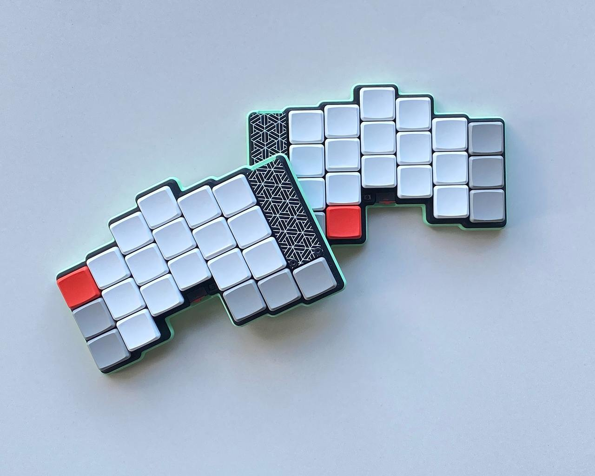
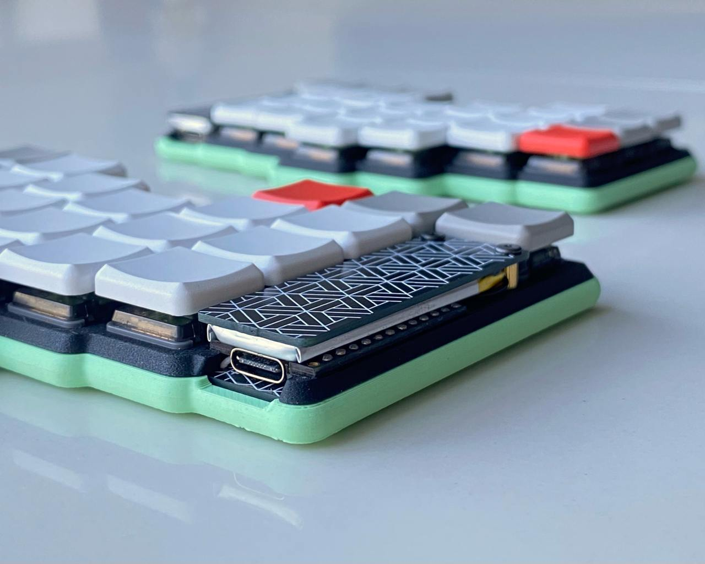

# gbEnki
gbEnki is a GB edition of the Enki ergonomic keyboard, available in 36- and 42-key layouts. Currently, only the case and optional plate files are available. The 42-key plate was originally designed by [@kotkota](https://github.com/kotkota), and I’ve adapted it for the 36-key version.

### Main features:
* 36/42 Choc v1 switches
* Magnets in the case to securely hold the keyboard halves together
* Easily accessible power switch and reset button
* Bluetooth support
* Choc spacing for compactness and comfort
* Compatibility with nice!view and OLED displays
* 3.5 mm jack for wired connectivity
* As thin as possible
* 3 led indicator
* [ZMK Studio](https://github.com/aroum/zmk-gbEnki)

## ZMK firmware
ZMK Firmware config with status indicator support can be downloaded [here](https://github.com/aroum/zmk-gbEnki).

--------------

